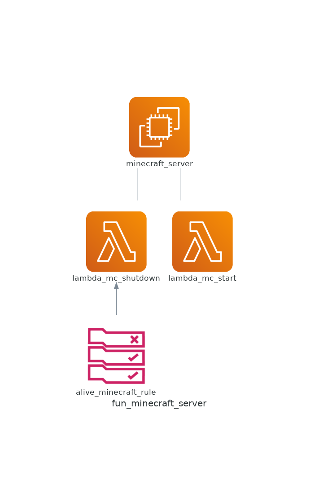

# fun_minecraft_server
Terraform Module to setup a minecraft server in AWS

## How to use?
```js
module "minecraft_server" {
    source = "git::https://github.com/diegotony/fun_minecraft_server.git?ref=main"
    name = "minecraft-server"
    description = "Just Survive" # optional
    tags = {"hey":"whats up"} # optional
}
```
## Resources


<!-- BEGIN_TF_DOCS -->
## Requirements

No requirements.

## Providers

| Name | Version |
|------|---------|
| <a name="provider_aws"></a> [aws](#provider\_aws) | n/a |

## Modules

| Name | Source | Version |
|------|--------|---------|
| <a name="module_create_attact_policy"></a> [create\_attact\_policy](#module\_create\_attact\_policy) | git::https://github.com/diegotony/aws_policy.git | first_version |
| <a name="module_lambda_mc_shutdown"></a> [lambda\_mc\_shutdown](#module\_lambda\_mc\_shutdown) | git::https://github.com/diegotony/aws_lambda_function.git | v1.1.0 |
| <a name="module_lambda_mc_start"></a> [lambda\_mc\_start](#module\_lambda\_mc\_start) | git::https://github.com/diegotony/aws_lambda_function.git | v1.1.0 |
| <a name="module_server"></a> [server](#module\_server) | git::https://github.com/diegotony/aws_ec2_instance.git | main |

## Resources

| Name | Type |
|------|------|
| [aws_network_interface_sg_attachment.this](https://registry.terraform.io/providers/hashicorp/aws/latest/docs/resources/network_interface_sg_attachment) | resource |
| [aws_security_group.this](https://registry.terraform.io/providers/hashicorp/aws/latest/docs/resources/security_group) | resource |

## Inputs

| Name | Description | Type | Default | Required |
|------|-------------|------|---------|:--------:|
| <a name="input_name"></a> [name](#input\_name) | Server name | `string` | n/a | yes |
| <a name="input_description"></a> [description](#input\_description) | Give a description to Server | `string` | `"Just Survive"` | no |
| <a name="input_egress"></a> [egress](#input\_egress) | Outbound Config | <pre>map(object({<br>    description = string<br>    from_port   = string<br>    to_port     = string<br>    protocol    = string<br>    cidr_blocks = any<br>    allow       = string<br>    type        = string<br>  }))</pre> | <pre>{<br>  "default": {<br>    "allow": "true",<br>    "cidr_blocks": [<br>      "0.0.0.0/0"<br>    ],<br>    "description": "default",<br>    "from_port": 0,<br>    "protocol": "-1",<br>    "to_port": 0,<br>    "type": "egress"<br>  }<br>}</pre> | no |
| <a name="input_ingress"></a> [ingress](#input\_ingress) | Inbound Config | <pre>map(object({<br>    description = string<br>    from_port   = string<br>    to_port     = string<br>    protocol    = string<br>    cidr_blocks = any<br>    allow       = string<br>    type        = string<br>  }))</pre> | <pre>{<br>  "http-80": {<br>    "allow": "true",<br>    "cidr_blocks": [<br>      "0.0.0.0/0"<br>    ],<br>    "description": "Allow port 80 from VPC",<br>    "from_port": 80,<br>    "protocol": "tcp",<br>    "to_port": 80,<br>    "type": "ingress"<br>  },<br>  "minecraft": {<br>    "allow": "true",<br>    "cidr_blocks": [<br>      "0.0.0.0/0"<br>    ],<br>    "description": "Allow port 25565 from VPC",<br>    "from_port": 25565,<br>    "protocol": "tcp",<br>    "to_port": 25565,<br>    "type": "ingress"<br>  },<br>  "ssh-22": {<br>    "allow": "true",<br>    "cidr_blocks": [<br>      "0.0.0.0/0"<br>    ],<br>    "description": "Allow port 22 from VPC",<br>    "from_port": 22,<br>    "protocol": "tcp",<br>    "to_port": 22,<br>    "type": "ingress"<br>  }<br>}</pre> | no |
| <a name="input_minecraft_server_url"></a> [minecraft\_server\_url](#input\_minecraft\_server\_url) | Minecraft server URl (1.19 for default) | `string` | `"https://launcher.mojang.com/v1/objects/e00c4052dac1d59a1188b2aa9d5a87113aaf1122/server.jar"` | no |
| <a name="input_tags"></a> [tags](#input\_tags) | tags | `map` | <pre>{<br>  "Environment": "minecraft-server",<br>  "created-by": "terraform",<br>  "owner": "Notch"<br>}</pre> | no |

## Outputs

No outputs.
<!-- END_TF_DOCS -->